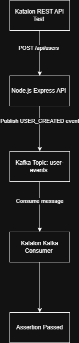
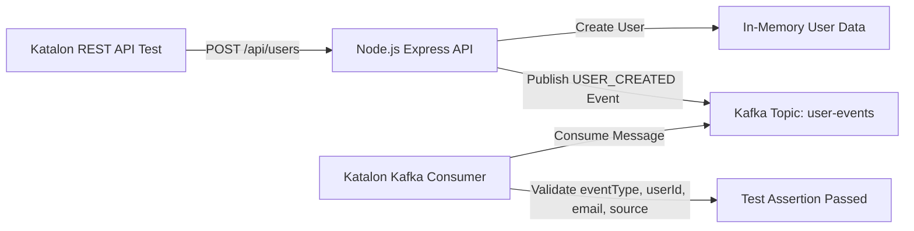
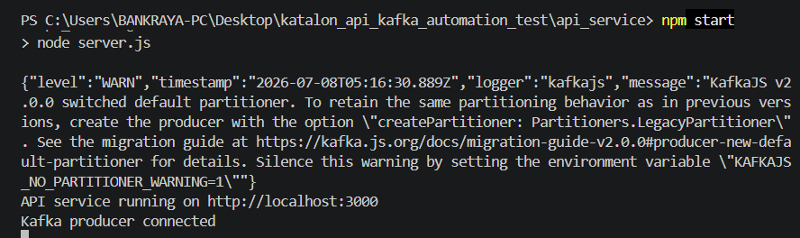
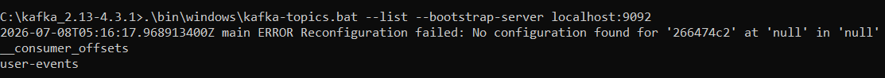
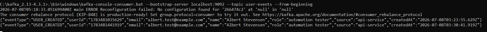
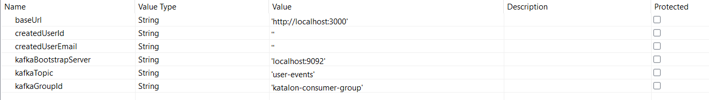

# Katalon API Kafka Automation Test

This repository contains an automation testing project using **Katalon Studio** for REST API testing and Kafka message validation.

The project was created for a technical test with the following scope:

1. RESTful API testing where **Katalon acts as producer and consumer**.
2. Kafka testing where **Katalon acts as consumer**.

## Project Overview

This project consists of a simple Node.js REST API, Apache Kafka running locally on Windows, and Katalon Studio as the automation testing tool.

The REST API is responsible for creating and retrieving user data. When a user is created through the API, the service publishes a `USER_CREATED` event to Kafka. Katalon validates the REST API response and consumes the Kafka message to verify that the event data is correct.

## Architecture Flow





## Tech Stack

| Component | Technology |
|---|---|
| Automation Tool | Katalon Studio |
| Test Script Language | Groovy |
| API Service | Node.js, Express.js |
| Message Broker | Apache Kafka |
| Kafka Producer | KafkaJS |
| Kafka Consumer in Katalon | Kafka Java Client |
| Runtime | Java 17+, Node.js |

## Project Structure

```text
katalon_api_kafka_automation_test
│
├── api_service
│   ├── node_modules
│   ├── package-lock.json
│   ├── package.json
│   └── server.js
│
├── katalon_project
│   ├── Drivers
│   ├── Keywords
│   ├── Profiles
│   ├── Test Cases
│   ├── Test Suites
│   └── Object Repository
│
├── docs
│   └── images
│       ├── architecture-flow.png
│       ├── api-running.png
│       ├── kafka-topic-created.png
│       ├── kafka-message-consumed.png
│       ├── katalon-profile-variables.png
│       └── katalon-test-suite-passed.png
│
├── README.md
└── .gitignore
```

## REST API Specification

### Base URL

```text
http://localhost:3000
```

### Endpoints

| Method | Endpoint | Description |
|---|---|---|
| POST | `/api/users` | Create a new user |
| GET | `/api/users` | Get all users |
| GET | `/api/users/:id` | Get user by ID |

### Sample Create User Request

```json
{
  "name": "Albert Stevensen",
  "email": "albert.test@example.com",
  "role": "automation tester"
}
```

### Sample Create User Response

```json
{
  "message": "User created successfully",
  "data": {
    "id": "1720xxxxxxx",
    "name": "Albert Stevensen",
    "email": "albert.test@example.com",
    "role": "automation tester",
    "createdAt": "2026-07-08T00:00:00.000Z"
  }
}
```

## Kafka Specification

### Kafka Broker

```text
localhost:9092
```

### Kafka Topic

```text
user-events
```

### Kafka Event

When a user is created, the API publishes the following event to Kafka:

```json
{
  "eventType": "USER_CREATED",
  "userId": "1720xxxxxxx",
  "email": "albert.test@example.com",
  "name": "Albert Stevensen",
  "role": "automation tester",
  "source": "api-service",
  "createdAt": "2026-07-08T00:00:00.000Z"
}
```

## Prerequisites

Before running the project, make sure the following tools are installed:

1. Node.js
2. Java JDK 17 or later
3. Apache Kafka binary for Windows
4. Katalon Studio
5. Git

Validate Java installation:

```bat
java -version
```

Validate Node.js installation:

```bat
node -v
npm -v
```

## Setup and Run API Service

Go to the API service folder:

```bat
cd api_service
```

Install dependencies:

```bat
npm install
```

Run the API service:

```bat
npm start
```

Expected output:

```text
API service running on http://localhost:3000
Kafka producer connected
```



## Setup and Run Kafka on Windows

Go to the Kafka installation folder:

```bat
cd C:\kafka_2.13-4.3.1
```

Generate Kafka cluster ID:

```bat
.\bin\windows\kafka-storage.bat random-uuid
```

Format Kafka storage:

```bat
.\bin\windows\kafka-storage.bat format --standalone -t <cluster-id> -c .\config\server.properties
```

Start Kafka server:

```bat
.\bin\windows\kafka-server-start.bat .\config\server.properties
```

Keep this terminal open while running the test.

Create Kafka topic:

```bat
.\bin\windows\kafka-topics.bat --create --topic user-events --bootstrap-server localhost:9092
```

Check Kafka topic:

```bat
.\bin\windows\kafka-topics.bat --list --bootstrap-server localhost:9092
```

Expected output:

```text
user-events
```



Run Kafka console consumer for manual validation:

```bat
.\bin\windows\kafka-console-consumer.bat --bootstrap-server localhost:9092 --topic user-events --from-beginning
```

After sending a POST request to `/api/users`, a `USER_CREATED` message should appear in the consumer terminal.



## Manual API Test

Create a user manually using curl:

```bat
curl.exe -X POST http://localhost:3000/api/users -H "Content-Type: application/json" -d "{\"name\":\"Albert Stevensen\",\"email\":\"albert.test@example.com\",\"role\":\"automation tester\"}"
```

Get all users:

```bat
curl.exe http://localhost:3000/api/users
```

Get user by ID:

```bat
curl.exe http://localhost:3000/api/users/<user-id>
```

## Katalon Configuration

### Global Variables

Configure the following variables in Katalon Profile:

| Variable | Value |
|---|---|
| `baseUrl` | `http://localhost:3000` |
| `createdUserId` | empty string |
| `createdUserEmail` | empty string |
| `kafkaBootstrapServer` | `localhost:9092` |
| `kafkaTopic` | `user-events` |
| `kafkaGroupId` | `katalon-consumer-group` |



### Kafka Java Client Library

Katalon does not provide native Kafka testing features. Therefore, Kafka consumer validation is implemented using a custom Groovy keyword with Kafka Java Client libraries.

Copy Kafka client JAR files from:

```text
C:\kafka_2.13-4.3.1\libs
```

to the Katalon project folder:

```text
katalon_project\Drivers
```

At minimum, the following JAR files are required:

```text
kafka-clients-4.3.1.jar
slf4j-api-*.jar
lz4-java-*.jar
zstd-jni-*.jar
snappy-java-*.jar
```

After copying the JAR files, restart Katalon Studio.

## Katalon Test Cases

| Test Case | Description |
|---|---|
| `TC001_Create_User` | Send POST request to create a user and store `createdUserId` and `createdUserEmail` |
| `TC002_Get_User_By_ID` | Send GET request using `createdUserId` and validate the retrieved user |
| `TC003_Get_All_Users` | Send GET request to retrieve all users |
| `TC004_Consume_User_Event_Kafka` | Consume Kafka message and validate `USER_CREATED` event |

## Test Suite

Test suite name:

```text
TS_API_KAFKA_E2E
```

Execution order:

```text
1. TC001_Create_User
2. TC002_Get_User_By_ID
3. TC003_Get_All_Users
4. TC004_Consume_User_Event_Kafka
```

The order is important because the Kafka consumer test validates the event generated by `TC001_Create_User`.

## Test Coverage

| Area | Scenario | Expected Result |
|---|---|---|
| REST API | Create user | Status code 201 and user data is created |
| REST API | Get user by ID | Status code 200 and user data matches created user |
| REST API | Get all users | Status code 200 and user list is returned |
| Kafka | Consume `USER_CREATED` event | Kafka message contains correct `eventType`, `userId`, `email`, and `source` |

## Screenshot Evidence

The following screenshots are recommended as execution evidence.

### 1. Architecture Flow

File name:

```text
docs/images/architecture-flow.png
```

Capture this after creating the project flow diagram. The diagram should show:

```text
Katalon REST API Test
→ Node.js Express API
→ Kafka Topic user-events
→ Katalon Kafka Consumer
→ Test Assertion Passed
```

This screenshot helps reviewers understand the end-to-end test flow.

### 2. API Service Running

File name:

```text
docs/images/api-running.png
```

Capture this after running:

```bat
npm start
```

The screenshot should show:

```text
API service running on http://localhost:3000
Kafka producer connected
```

This proves that the API service is running and connected to Kafka.

### 3. Kafka Topic Created

File name:

```text
docs/images/kafka-topic-created.png
```

Capture this after running:

```bat
.\bin\windows\kafka-topics.bat --list --bootstrap-server localhost:9092
```

The screenshot should show:

```text
user-events
```

This proves that the Kafka topic has been created.

### 4. Kafka Message Consumed

File name:

```text
docs/images/kafka-message-consumed.png
```

Capture this after running Kafka console consumer:

```bat
.\bin\windows\kafka-console-consumer.bat --bootstrap-server localhost:9092 --topic user-events --from-beginning
```

Then send a POST request to the API. The screenshot should show a message like:

```json
{"eventType":"USER_CREATED","userId":"1720xxxxxxx","email":"albert.test@example.com","name":"Albert Stevensen","role":"automation tester","source":"api-service","createdAt":"2026-07-08T00:00:00.000Z"}
```

This proves that the API successfully published a message to Kafka and the message can be consumed.

### 5. Katalon Profile Variables

File name:

```text
docs/images/katalon-profile-variables.png
```

Capture this after configuring Katalon Profile variables:

```text
baseUrl
createdUserId
createdUserEmail
kafkaBootstrapServer
kafkaTopic
kafkaGroupId
```

This proves that the test environment configuration is parameterized properly.

### 6. Katalon Test Suite Passed

File name:

```text
docs/images/katalon-test-suite-passed.png
```

Capture this after running the full Katalon test suite:

```text
TS_API_KAFKA_E2E
```

The screenshot should show all test cases passed:

```text
TC001_Create_User                 PASSED
TC002_Get_User_By_ID              PASSED
TC003_Get_All_Users               PASSED
TC004_Consume_User_Event_Kafka    PASSED
```

This is the most important screenshot because it proves that the automation test runs successfully end-to-end.

## Expected Result

After running the full test suite, all test cases should pass:

```text
TC001_Create_User                 PASSED
TC002_Get_User_By_ID              PASSED
TC003_Get_All_Users               PASSED
TC004_Consume_User_Event_Kafka    PASSED
```

## Notes

This project uses in-memory data storage. User data will be reset when the API service is restarted.

Kafka is used to publish a `USER_CREATED` event after successful user creation. Katalon consumes this event using a custom Kafka consumer keyword.

This project is intended for automation testing demonstration and technical test submission.